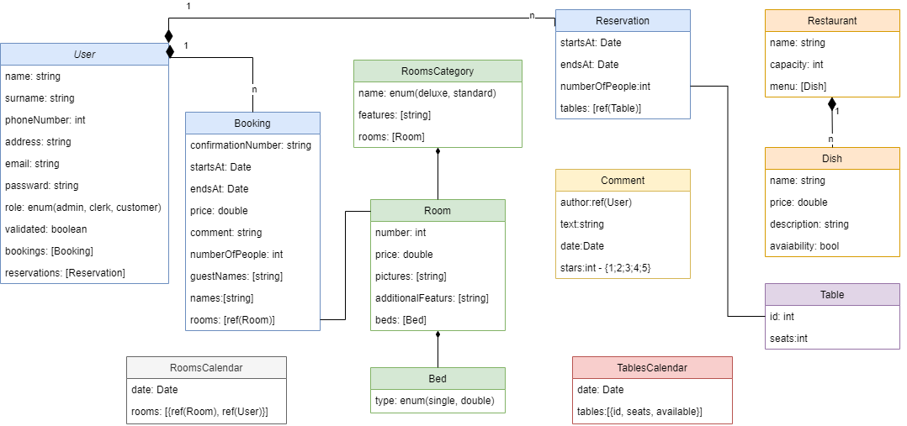

<!-- Heading -->
# Web application - student project

## General informations:
<!-- UL-->
* ### Subject at university: Advanced Database Technologies

* ### Work methodology: SCRUM (Github project tab)

* ### Technologies: Node.js, Express.js, MongoDB, Mongoose

# Documentation:

## Database schema:

# API:
| Users    | Booking | Room |Comment |
| -------- |---| ------- |------- |
| `GET` /users | `GET` /bookings | `GET` /rooms |`GET` /comments |
| `GET` /users/id | `GET` /bookings/id | `GET` /rooms/id |`POST` /comments |
| `POST` /users | `POST` /bookings | `GET` /rooms/where/parameters |`PUT` /comments/id |
| `PUT` /users/id | `PUT` /bookings/id | `GET` /rooms/category |`DELETE` /comments/id |
| `DELETE` /users/id | `DELETE` /bookings/id | `PUT` /rooms/id |
| | | `POST` /rooms/category |
| | | `POST` /rooms |
| | | `PATCH` /rooms/category/id |
| | | `DELETE` /rooms/category/id |

| Restaurant | Table | Reservation |
| ------- | ------- |  --- |
| `GET` /restaurant/menu |`GET` /tables | `GET` /reservation |
| `GET` /restaurant/dish/id |`GET` /tables/id | `GET` /reservation/id |
| `GET` /restaurant/openHours |`GET` /tables/available/parameters |`POST` /reservation |
| `POST` /restaurant/dish |`POST` /tables  |`PUT` /reservation/id |
| `POST` /restaurant |`PUT` /tables/id  |`DELETE` /reservation/id |
| `PATCH` /restaurant |`DELETE` /tables/id  |
| `PUT` /restaurant/dish/id |
| `DELETE` /restaurant/dish/id |
| `DELETE` /restaurant/id |

## Catalog structure:

<pre>
|___.gitignore
|___README.md
|___frontend
|___backend___
              |___README.md
              |___.eslintrc.json
              |___package-lock.json
              |___package.json
              |___src___
                        |___server.js
                        |___middleware -> logic for: authentication, authorization, ...
                        |___models -> database models
                        |___routes -> application routes (urls)
                        |___controllers -> all business logic
                        |_____tests__ -> unit tests, integration Tests, ...
</pre>

# Developing rules:
<!-- UL-->
* ### branch namespace: feature or fix + "/" + the first part of issue title, for example: feature/backend-04, fix/backend-11, feature/documentation-02, ...
